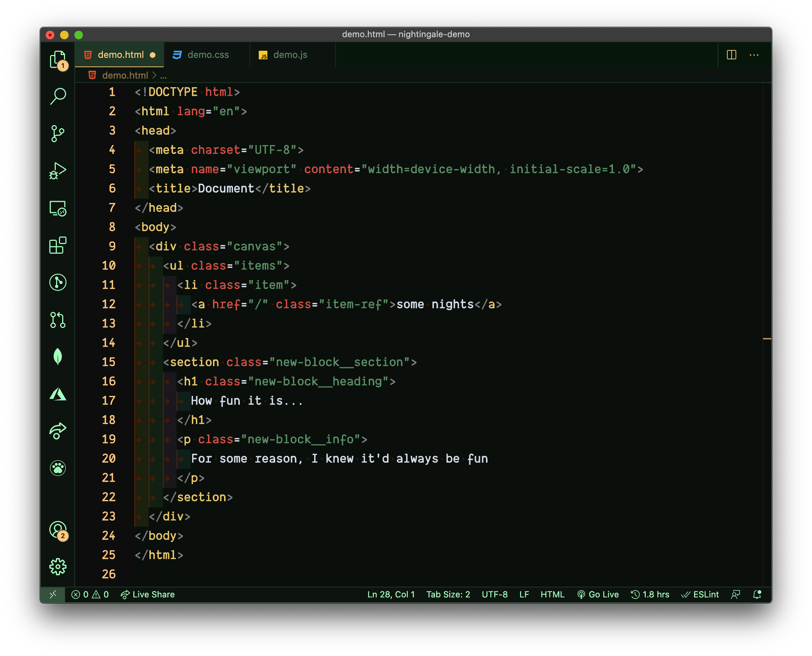
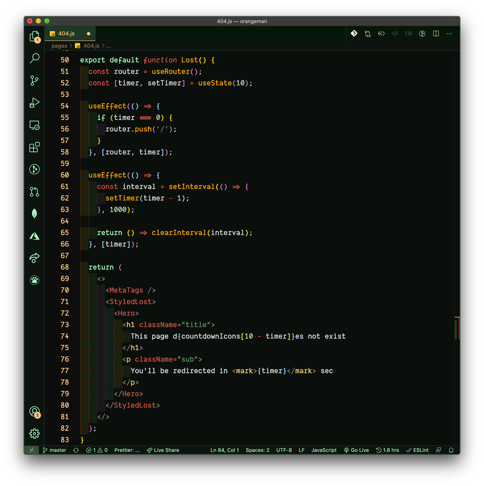

# Nightingale

Nightingale is a Visual Studio Code theme for nocturnal folks looking to code away into the scenery of the beautiful night. Enjoy!

## HTML

## CSS

## JavaScript

## React

# Installation

1.  Install [Visual Studio Code](https://code.visualstudio.com/)
2.  Launch Visual Studio Code
3.  Choose **Extensions** from menu
4.  Search for `nightingale`
5.  Click **Install** to install it (It should automatically apply, if not...go to 6)
6.  Click **Reload** to reload the Code
7.  From the menu bar click: Code > Preferences > Color Theme > **Nightingale**

# Uses

1. The font in the preview image is Dank Mono, [download it ＄ here](https://dank.sh/).

# Footnote

This is my first time building a VSCode theme so if you notice any issue, please let me know:
- [Twitter DM] (https://twitter.com/adebiyial)
- [GitHub issue](https://github.com/sdras/night-owl-vscode-theme)

Any relevant changes for each version are documented in the changelog. Please update and check the changelog before filing any issues, as they may have already been taken care of.

I will continue working on updates and pushing new changes every now and then.

Thank you! 👋